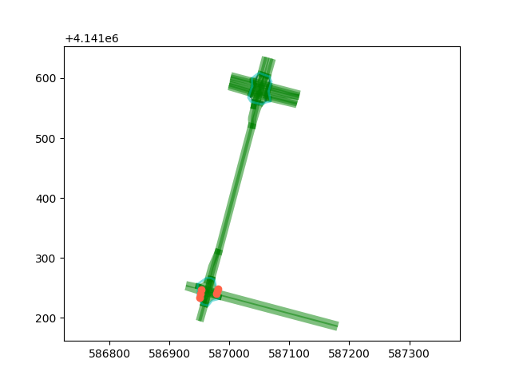

## Imap
Imap is a tool for visualize the hd-map. This project was inspired by Apollo.
```
data     // hd-map dir
main.py  // main process
map.py  // hd-map struct
editor.py  // user interaction
```

## Quick start
#### Install
There are 2 ways to install imap.
1. Install matplotlib and protobuf.
```
pip install -U matplotlib
pip install protobuf
```

2. Or you can install conda first, then install protobuf. Use `conda install protobuf` to install will fail, I haven't found the reason yet. Replace with the following command will work.
```
pip install protobuf
```

## Example
After the installation is complete, you can view the map with the following command.
```
python main.py -m data/borregas_ave.txt
// or
python main.py -m data/town.xodr
```

Currently supported formats:
1. Apollo map
2. OpenDrive map

The following is the display of the hd-map in `data\borregas_ave.txt`.You can click on the lane you want to display more detail info, which will display the current lane's id, as well as the predecessor and successor lane's id in the upper left corner.



## Format conversion
Now you can convert OpenDrive map to Apollo map by following command.
```
python main.py -f -i data/town.xodr -o data/apollo_map.txt
```

## Todo
1. add argparse.ArgumentParser
2. show map in more details (like layers, styles)
